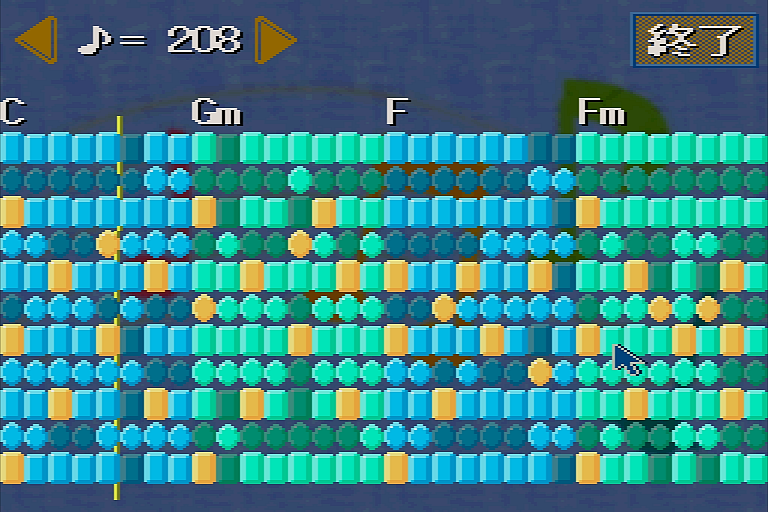
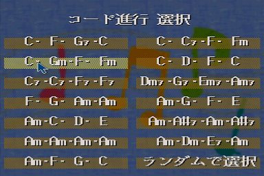
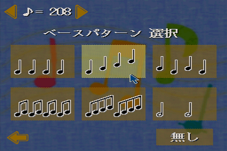
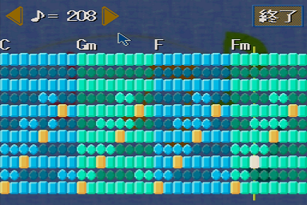

# お手軽作曲ツール「作曲気分」

コード進行に合わせて適当に音を置いて、４小節の短いメロディーを作って楽しむ X68000用のエンタメツールです。  

動作確認はエミュレータ（XM6 TypeG）上で行っており、実機を含めたその他の環境での動作は未確認です。  
動作は未確認ですが、一応 X68000 Z用に[起動ディスクのイメージ（XDFファイル）](https://github.com/raseene/X68_Composer/releases/latest/download/COMPOSER_XDF.zip)を用意しました。


  

## 起動方法

　[実行ファイル一式](https://github.com/raseene/X68_Composer/releases/latest/download/COMPOSER.zip)


ZMUSIC、または ZMSCを常駐させます。

```
ZMUSIC
 または
ZMSC
```

COMPOSER.Xを実行します。  
必要なファイルは以下の通りです。

```
COMPOSER.X
GRAPHIC\COMPOSER.SP
GRAPHIC\COMPOSER.PAL
GRAPHIC\BACK.PIC
GRAPHIC\BASSPAT.DAT
SOUND\COMPOSER.ZPD
SOUND\TONE.ZMD
```


または、[起動ディスクイメージ](https://github.com/raseene/X68_Composer/releases/latest/download/COMPOSER_XDF.zip)から起動してください。


## 操作方法

はじめにコード進行を選択します。コードによって、演奏中の押したボタンに対応する音程が変わります。  
「ランダムで選択」はここに挙げられたパターンの中からランダムで選択します。コード自体がランダムになるわけではありません。



次にベースパターンを選択します。  
ベースとしてパートが分かれているわけではなくいわゆる初期配置であり、このパターンのボタンがあらかじめ押された状態で始まります。



そして、メインである作曲・演奏画面に移ります。



マウスで明るいボタンを押すとそこに音を配置して、ラインが通った時に音が鳴るようになります。  
また、そのときに付近のボタンが押せるようになったり、逆に押せなくなったりします。これによって、適当にボタンを押してもそれなりにメロディーになるようになってます。  
すでに音が配置されたボタンを押して、その音を消すこともできます。このとき条件によって他の音のボタンも消えることがあります。

「終了」ボタンで演奏を終了して、コード進行選択画面に戻ります。


また、どの画面でもESCキーでツールを終了します。


## データの保存について

ツールを終了すると、最後の譜面の状態を COMPOSER.SAVというファイルに保存します。  
起動時にこのファイルを指定することによって、その譜面の状態から作曲・演奏画面を始めることができます。

```
COMPOSER COMPOSER.SAV
```

リネームやコピーでファイルネームを変えた場合でも、起動時に指定すればその譜面データで始まります。  
とっておきたい譜面データは、ファイルネームを変更して保存してください。

```
REN COMPOSER.SAV MEIKYOKU.SAV
COMPOSER MEIKYOKU.SAV
```

別のファイルで起動した場合も、保存は COMPOSER.SAVに行われます。  
譜面データを更新したい場合は、リネームまたはコピーをし直してください。


## 開発環境

yosshinさんのxdev68k( https://github.com/yosshin4004/xdev68k )を使用させていただきました。  
コンパイルする場合は上記環境を構築後、bashコンソール上の srcディレクトリで makeを実行してください。

```
cd src
make
```


## ライセンス

このプロジェクトのソースコードは、以下のライセンスの下に公開されています。

* MIT License(http://opensource.org/licenses/MIT)

